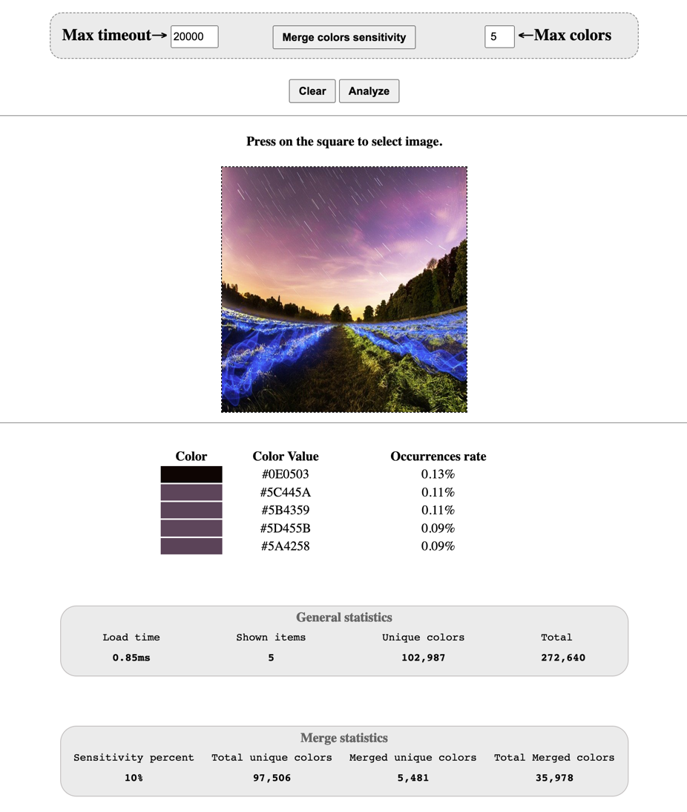

# php-image-dominant-colors

### Get dominant colors from image.

- PHP Minimum Version: 8.0
- No frameworks or libraries has been used.

### Frontend preview


## Installation

Clone the repo

```shell
git clone https://github.com/iNewLegend/php-image-dominant-colors
```

Enter the folder
```shell
cd php-image-dominant-colors
```

- Run development server:
```shell
$ ./run
```

- Go to http://localhost:8000 to reach the frontend.

## Other documents:

- [Development research](docs/development-research.md)
- [Bitmaps test suite](docs/bitmaps-test-suite.md)
