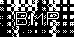
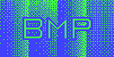
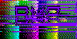

## Bitmaps test suite.

- Copyrights: http://entropymine.com/jason/bmpsuite/bmpsuite/html/bmpsuite.html
- Test can be against: https://onlinejpgtools.com/find-dominant-jpg-colors

---

### [1-ppb]:

1 bit/pixel paletted image, in which black is the first color in the palette.

1 bit/pixel paletted image, in which white is the first color in the palette.

---

### [2-ppb]:

A paletted image with 2 bits/pixel. Usually only 1, 4, and 8 are allowed, but 2 is legal on Windows CE.

Same as pal2.bmp, but with a color palette instead of grayscale palette.

### [4-ppb]:

Paletted image with 12 palette colors, and 4 bits/pixel.

Paletted image with 12 grayscale palette colors, and 4 bits/pixel.

4-bit image that uses RLE compression.

An RLE-compressed image that uses “delta” codes to skip over some pixels, leaving them undefined. Some viewers make undefined pixels transparent, others make them black, and others assign them palette color 0 (purple, in this case).

An RLE-compressed image that uses “delta” codes, and early EOL & EOBMP markers, to skip over some pixels. It’s okay if the viewer’s image doesn’t exactly match any of the reference images.

---

### [8-ppb]:

Our standard paletted image, with 252 palette colors, and 8 bits/pixel.

Every field that can be set to 0 is set to 0: pixels/meter=0; colors used=0 (meaning the default 256); size-of-image=0.

An 8-bit image with a palette of 252 grayscale colors.

